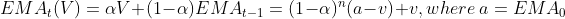
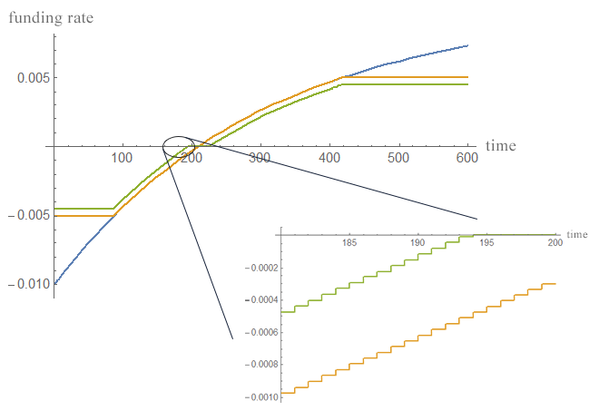
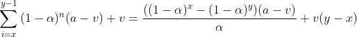
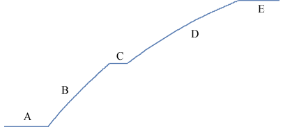

# Implementation of Funding Rate

The on-chain trading interface is the only way other smart contracts can interact with the decentralized perpetual contract where a key feature is the funding rate. So that we must calculate the funding rate in the smart contract.

MEKE protocol continuously measures the difference between Mark Price of the Perpetual contract and Chainlink's ETH/USD Index. The percentage difference between these two prices acts as the basis for the 8-hourly funding rate applied to all outstanding perpetual contracts.

A positive Funding rate means longs (long position holders) pay to fund shorts (short position holders). Similarly, a negative Funding rate means shorts (short position holders) pay to fund longs (long position holders). Funding payments are automatically calculated every second and are added to or subtracted from the PNL.

## Fair price

MEKE protocol uses the last execution price when match order as the `FairPrice`.

## EMA of premium

The `MarkPrice` is derived using both the `LastIndex` and the `FairPrice`, by adding to the Index the 600 seconds exponential moving average (EMA) of the `Fair Price - LastIndex`.

We can rewrite the recursive formula of EMA as a general term, so as to calculate the final result since the last on-chain state.

[](https://www.codecogs.com/eqnedit.php?latex={EMA}_t(V)&space;=&space;\alpha&space;V&plus;(1-\alpha)&space;{EMA}_{t-1}=(1-\alpha)^n(a-v)&plus;v,&space;where~a&space;=&space;EMA_0)

So we can define the `EMAPremium` as:

```
LastIndexPrice := Read the oracle
LastPremium:= FairPrice - LastIndexPrice
n:= Now() - LastFundingTime
EMAPremium:= (LastEMAPremium - LastPremium) * Pow(1 - GovEMAAlpha, n) + LastPremium
```

Note that all variables starting with "last" will be saved to the contract storage, so after this transaction the person who calls the contract will think it is an old value.

## Funding rate

```
MarkPrice: LastIndexPrice + EMAPremium, Limited by (LastIndexPrice * (1 ± GovMarkPremiumLimit))
PremiumRate: (MarkPrice - LastIndexPrice) / LastIndexPrice
FundingRate: Maximum(GovFundingDampener, PremiumRate) + Minimum(-GovFundingDampener, PremiumRate)
```

The `FundingRate` can also be considered as `EMAPremium / LastIndexPrice` with clip and dampener. Blue: premium rate without clip. Yellow: premium rate. Green: final funding rate.



Note that we treat the funding rate as changing every second, so that the function image is a discontinuous curve.

## Funding payment

The `FundingRate` is defined as a 8-hour interest rate. User's payment depends on the holding time.

```
FundingPayment: The collateral paid/received = FundingRate * IndexPrice * PositionSize * HoldPositionTimeSpan / 8hours
```

Since the smart contract cannot actually be executed once per second, the contract will accumulate all values since the last on-chain state each time it is executed in a transaction. For example, the last recording time was `LastFundingTime`, then this accumulation interval is [LastFundingTime, block.time). The value of current second is not accumulated, so the formula can support multiple transactions in a block.

[](https://www.codecogs.com/eqnedit.php?latex=\sum_{i=x}^{y-1}{(1-\alpha)^n(a-v)&plus;v}=\frac{((1-\alpha)^x-(1-\alpha)^y)(a-v)}{\alpha}&plus;v(y-x))

So sigma between [x, y) is:

```
R(x, y) = (LastEMAPremium - LastPremium)*(Pow(1 - GovEMAAlpha, x) - Pow(1 - GovEMAAlpha, y))/(GovEMAAlpha) + LastPremium * (y - x)
```

We also need to know when `PremiumRate` has reached the damper and limit. Solve the `t` from equation:

[](https://www.codecogs.com/eqnedit.php?latex=markPriceWithoutClip&space;=&space;index&space;&plus;&space;emaPremium&space;\newline&space;premiumRateWithoutClip&space;=&space;\frac{markPriceWithoutClip&space;-&space;index}{index}&space;\newline&space;premiumRateWithoutClip&space;=&space;someRatio&space;\newline&space;\rightarrow&space;t&space;=&space;Log_{1-\alpha}{\frac{lastPremium&space;-&space;index\cdot&space;someRatio}{lastPremium&space;-&space;a}})

```
v0 = LastEMAPremium
T(y) = Log(1 - GovEMAAlpha, (y-LastPremium)/(v0-LastPremium)), ceiling to integer, where y = index * some ratio
```

## Accumulated funding payment

`FundingPayment` for each position of all users is the same for a period of time. So in the contract we recorded the cumulative payment for each position since the creation of the `Perpetual` contract.

```
AccumulatedFundingPerContract:+= Acc / (8*3600), where Acc is accumulated funding payment per position since lastFundingTime
```

In order to calculate the `Acc`, consider that the funding rate will cross up to 4 special boundary values (`-GovMarkPremiumLimit`, `-GovFundingDampener`, `+GovFundingDampener`, `+GovMarkPremiumLimit`). 4 points segment the curve into 5 parts, so that the calculation can be arranged into 5 * 5 = 25 cases. In order to reduce the amount of calculation, the code is expanded into 25 branches.



```
- v0 = LastEMAPremium; vt = (LastEMAPremium - LastPremium) * Pow(1 - GovEMAAlpha, n) + LastPremium
- vLimit = GovMarkPremiumLimit * LastIndexPrice
- vDampener = GovFundingDampener * LastIndexPrice
- If v0 <= -vLimit:
  - If vt <= -vLimit:                       // 1. A -> A
    - Acc = (-vLimit + vDampener) * n
  - ELSE If vt <= -vDampener:               // 2. A -> B
    - t1:= T(-vLimit);
    - Acc = (-vLimit) * t1 + R(t1, n) + vDampener * n
  - ELSE If vt <= +vDampener:               // 3. A -> C
    - t1:= T(-vLimit); t2:= T(-vDampener); 
    - Acc = (-vLimit) * t1 + R(t1, t2) + vDampener * t2
  - ELSE If vt <= +vLimit:                  // 4. A -> D
    - t1:= T(-vLimit); t2:= T(-vDampener); t3:= T(+vDampener);
    - Acc = (-vLimit) * t1 + R(t1, t2) + R(t3, n) + vDampener * (t2 - (n - t3))
  - ELSE:                                   // 5. A -> E
    - t1:= T(-vLimit); t2:= T(-vDampener); t3:= T(+vDampener); t4:= T(+vLimit);
    - Acc = (-vLimit) * t1 + R(t1, t2) + R(t3, t4) + vLimit * (n - t4) + vDampener * (t2 - (n - t3))
- If v0 <= -vDampener:
  - If vt <= -vLimit:                       // 6. B -> A
    - t4:= T(-vLimit);
    - Acc = R(0, t4) + (-vLimit) * (n - t4) + vDampener * n
  - ELSE If vt <= -vDampener:               // 7. B -> B
    - Acc = R(0, n) + vDampener * n
  - ELSE If vt <= +vDampener:               // 8. B -> C
    - t2:= T(-vDampener); 
    - Acc = R(0, t2) + vDampener * t2
  - ELSE If vt <= +vLimit:                  // 9. B -> D
    - t2:= T(-vDampener); t3:= T(+vDampener);
    - Acc = R(0, t2) + R(t3, n) + vDampener * (t2 - (n - t3))
  - ELSE:                                   // 10. B -> E
    - t2:= T(-vDampener); t3:= T(+vDampener); t4:= T(+vLimit);
    - Acc = R(0, t2) + R(t3, t4) + vLimit * (n - t4) + vDampener * (t2 - (n - t3))
- If v0 <= +vDampener:
  - If vt <= -vLimit:                       // 11. C -> A
    - t3:= T(-vDampener); t4:= T(-vLimit);
    - Acc = R(t3, t4) + (-vLimit) * (n - t4) + vDampener * (n - t3)
  - ELSE If vt <= -vDampener:               // 12. C -> B
    - t3:= T(-vDampener);
    - Acc = R(t3, n) + vDampener * (n - t3)
  - ELSE If vt <= +vDampener:               // 13. C -> C
    - Acc = 0
  - ELSE If vt <= +vLimit:                  // 14. C -> D
    - t3:= T(+vDampener);
    - Acc = R(t3, n) - vDampener * (n - t3)
  - ELSE:                                   // 15. C -> E
    - t3:= T(+vDampener); t4:= T(+vLimit);
    - Acc = R(t3, t4) + vLimit * (n - t4) - vDampener * (n - t3)
- If v0 <= +vLimit:
  - If vt <= -vLimit:                       // 16. D -> A
    - t2:= T(+vDampener); t3:= T(-vDampener); t4:= T(-vLimit);
    - Acc = R(0, t2) + R(t3, t4) + (-vLimit) * (n - t4) + vDampener * (n - t3 - t2)
  - ELSE If vt <= -vDampener:               // 17. D -> B
    - t2:= T(+vDampener); t3:= T(-vDampener);
    - Acc = R(0, t2) + R(t3, n) + vDampener * (n - t3 - t2)
  - ELSE If vt <= +vDampener:               // 18. D -> C
    - t2:= T(+vDampener);
    - Acc = R(0, t2) - vDampener * t2
  - ELSE If vt <= +vLimit:                  // 19. D -> D
    - Acc = R(0, n) - vDampener * n
  - ELSE:                                   // 20. D -> E
    - t4:= T(+vLimit);
    - Acc = R(0, t4) + vLimit * (n - t4) - vDampener * n
- Else:
  - If vt <= -vLimit:                       // 21. E -> A
    - t1:= T(+vLimit); t2:= T(+vDampener); t3:= T(-vDampener); t4:= T(-vLimit);
    - Acc = vLimit * t1 + R(t1, t2) + R(t3, t4) + (-vLimit) * (n - t4) + vDampener * (n - t3 - t2)
  - ELSE If vt <= -vDampener:               // 22. E -> B
    - t1:= T(+vLimit); t2:= T(+vDampener); t3:= T(-vDampener);
    - Acc = vLimit * t1 + R(t1, t2) + R(t3, n) + vDampener * (n - t3 - t2)
  - ELSE If vt <= +vDampener:               // 23. E -> C
    - t1:= T(+vLimit); t2:= T(+vDampener);
    - Acc = vLimit * t1 + R(t1, t2) - vDampener * t2
  - ELSE If vt <= +vLimit:                  // 24. E -> D
    - t1:= T(+vLimit);
    - Acc = vLimit * t1 + R(t1, n) - vDampener * n
  - ELSE:                                   // 25. E -> E
    - Acc = (vLimit - vDampener) * n
```
