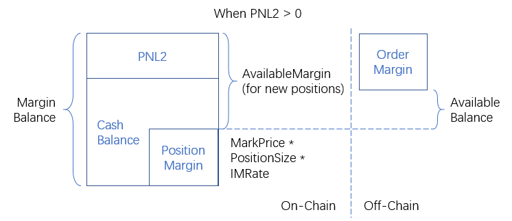
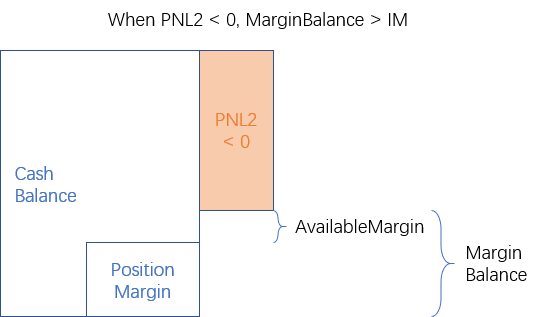

# Perpetual Margin-Account Model

## On-Chain part

| Term | Definition |
|------|------------|
| CashBalance | Deposited collateral |
| MarginBalance | `CashBalance + PNL2` |
| PositionMargin | `MarkPrice * PositionSize * IMRate` |
| MaintenanceMargin | `MarkPrice * PositionSize * MMRate` |
| AvailableMargin | The balance that can open new positions = `MarginBalance - PositionMargin` |
| IsSafe | `MarginBalance >= MaintenanceMargin` |
| PNL1 | Long position: `(MarkPrice - AvgEntryPrice) * PositionSize` Short position: `(AvgEntryPrice - MarkPrice) * PositionSize` |
| PNL2 | `PNL1 - SocialLoss - FundingLoss` |

## Off-Chain part

| Term | Definition |
|------|------------|
| OrderMargin | `MarkPrice * OrderSize * IMRate` |
| AvailableBalance | `AvailableMargin - OrderMargin` |

## Example: PNL2 >= 0

## Example: PNL2 < 0

